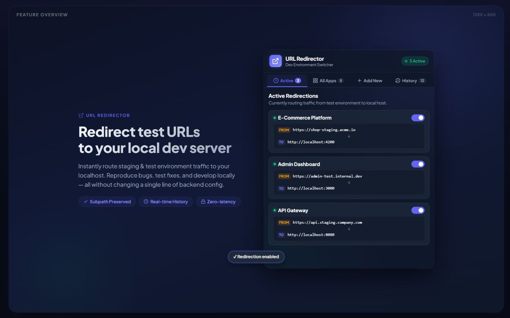

# LocalBridge  - Chrome Extension



> **Dev Environment Switcher**: Easily redirect external test environment URLs to your locally running development server (e.g. `https://app-testenv.com` $\rightarrow$ `http://localhost:4200`) for bug reproduction and local feature testing with real-time request history.

---

## Overview

When debugging issues in staging or test environments, developers often need to run and test fixes locally against test environment routes. **Local Bridge** intercepts web requests and routes them to your local dev environment.

### Key Features

- ** Subpath & Query Preservation**: Subpaths, routes, and query parameters are automatically preserved during redirection.
  - *Example*: `https://app-testenv.com/dashboard?user=42` $\rightarrow$ `http://localhost:4200/dashboard?user=42`
- ** This extension includes 4-Tabs**:
  - **Active Tab**: Displays currently active redirection rules with quick toggle-off switches and live status indicator.
  - **All Apps Tab**: Overview of all saved application mappings with search filtering, edit modal, enable/disable switches, and deletion controls.
  - **Add New Tab**: Simple setup form for new application mappings with quick port selection presets (`:4200` Angular, `:3000` React/Next, `:5173` Vite, `:8080` Vue).
  - **History Tab**: Real-time log of all original intercepted URLs with exact date & timestamp (`YYYY-MM-DD HH:mm:ss`), application source badges, single-item deletion, clear-all action, and quick copy-to-clipboard buttons.
- **Live Badge Count**: Dynamic toolbar badge indicates the number of active redirections currently running.
- **Local Storage Persistence**: Configuration and history logs are automatically saved in browser storage (`chrome.storage.sync` with local fallback).

---

## Project Structure

```text
URLRedirector/
├── manifest.json        # Manifest V3 extension configuration & permissions
├── background.js        # Background service worker managing dynamic redirect rules & history logging
├── README.md            # Project documentation
├── icons/               # Extension icons
│   ├── icon16.png
│   ├── icon48.png
│   └── icon128.png
└── popup/               # Popup UI elements
    ├── popup.html       # 4-Tab popup structure & edit modal
    ├── popup.css        # Dark mode glassmorphic styling & UI animations
    └── popup.js         # Tab switching, application CRUD, history manager & storage engine
```

---

## Installation Guide

1. Clone or download this repository to your local computer:
   ```bash
   ...\URLRedirector
   ```
2. Open **Google Chrome** and navigate to `chrome://extensions`.
3. Enable **Developer mode** using the toggle switch in the top-right corner.
4. Click **Load unpacked** in the top-left corner.
5. Select the project directory (`URLRedirector`).
6. Pin **LocalBridge** to your extension toolbar for quick access.

---

## How to Use

1. Click the **LocalBridge** extension icon in your Chrome toolbar.
2. Go to the **Add New** tab:
   - **Application Name**: `My Test Project`
   - **Source URL**: `app-testenv.com` (or full URL `https://app-testenv.com`)
   - **Target URL**: `localhost:4200` (or select a port preset)
3. Click **Save & Add Application**.
4. The redirection rule is activated immediately! Navigate to `https://app-testenv.com` in your browser to verify traffic routing to `http://localhost:4200`.
5. Switch to the **History** tab anytime to inspect original intercepted URLs with date & time logs (`2026-08-24 19:30:25`), copy URLs, or clear history.

---

## Data Models

### Application Config
```json
{
  "id": "app_1722259200000_102",
  "name": "E-Commerce App",
  "sourceUrl": "https://app-testenv.com",
  "targetUrl": "http://localhost:4200",
  "enabled": true,
  "createdAt": 1722259200000
}
```

### Intercepted History Record
```json
{
  "id": "hist_1724520625000_a1b2c",
  "appId": "app_1722259200000_102",
  "appName": "E-Commerce App",
  "originalUrl": "https://app-testenv.com/login?debug=1",
  "redirectedUrl": "http://localhost:4200/login?debug=1",
  "timestamp": 1724520625000
}
```

---

## Built With

- **Manifest V3** (`declarativeNetRequest`, `webRequest`, `storage`)
- **Vanilla HTML5 / CSS3**
- **Vanilla JavaScript ES6+**

---

## License

MIT License. Free for developers and teams.
